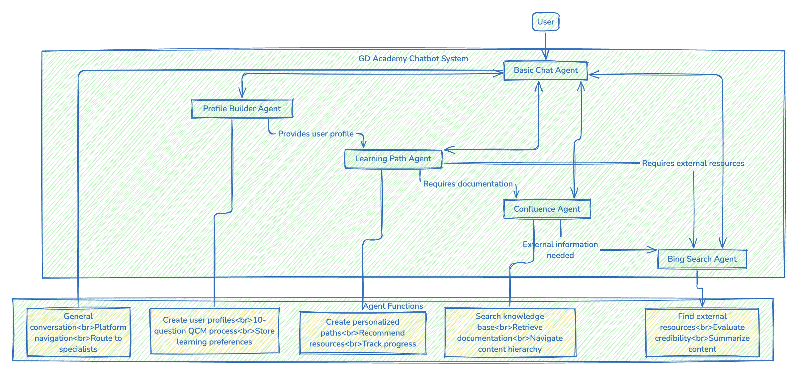

# Automated Learning Paths - Hackathon 2025

Project submission for participation in the **Microsoft Hackathon 2025**.

## AI-Powered Upskilling Chatbot

### Overview
This project implements an **AI-powered chatbot** designed to assist users in skill development across various domains. The system uses a multi-agent architecture, integrating specialized agents to manage personalized learning paths, profile building, and content discovery from both **internal** and **external** resources.

The chatbot leverages **Azure** tools such as **RAG (Retrieval-Augmented Generation)**, **File Search**, and **Bing Search** to provide users with relevant educational content. **Confluence** serves as the internal knowledge base, offering curated learning materials. With this, the chatbot creates a dynamic learning experience by combining internal and external sources to offer tailored educational journeys.

### Project Image



---

## System Architecture

### Multi-Agent Functionality
The chatbot operates through several specialized agents, ensuring an efficient and personalized learning process:

#### **Profile Collection**
- **Profile Builder Agent**: Collects user information to build a personalized learning profile, which serves as the foundation for the learning path.

#### **Knowledge Retrieval**
- **Confluence Agent**: Accesses GD Academy's internal knowledge base, providing users with detailed content on various topics.
- **Bing Search Agent**: Searches external resources like online courses, tutorials, and articles to enhance the learning experience with the latest external knowledge.

#### **Orchestration**
- **Semantic Kernel Agent**: Orchestrates the process by managing the flow of information between the agents, ensuring that user queries are routed to the appropriate agent for the best possible response. Also generates customized learning path based on the user's profile and the knowledge retreived. 

---

## Key Features

- **Personalized Learning Paths**: Curriculum recommendations based on user profiles and preferences.
- **Comprehensive Knowledge Access**: Seamless integration of internal (Confluence) and external (Bing Search) resources to provide diverse learning materials.
- **Multi-Agent System**: Specialized agents ensure high-quality, domain-specific responses tailored to the user’s needs.
- **Azure Integration**: Efficient data processing with **File Search** , **Bing search** and other Azure tools, improving system performance and scalability.

---
## Installation

To set up the project, follow these steps:

1. **Install dependencies**:
   ```bash
   uv sync
   ```

2. **Set up environment variables: Make sure you have a .env file in the backend with the variables configured as mentionned in the example.env file:**:


3. **Run the Backend: To run the backend, use the following command with uv**:

```bash
uv run python -m backend.src.main
```

1. **Run the Frontend: To run the frontend with Chainlit, use the following command:**:

```bash
uv run python -m chainlit run frontend/app.py
```

## Conclusion

The AI-Powered Upskilling Chatbot leverages the power of Azure tools, Confluence, and Bing Search to offer a comprehensive and personalized learning experience. The system is designed to guide users through building their profiles and generating custom learning paths that include both internal and external resources. By leveraging specialized agents, the chatbot ensures that each user receives the most relevant and up-to-date content for their educational journey.