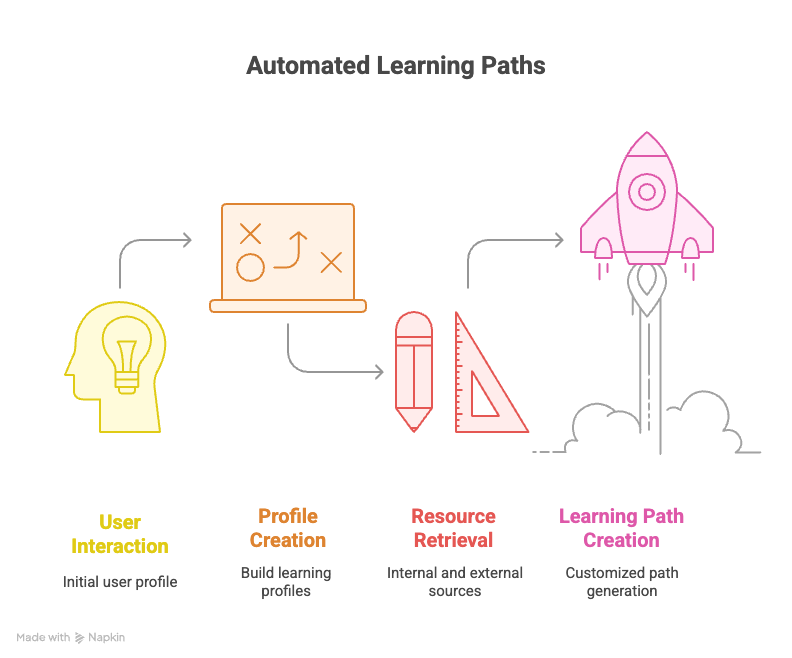
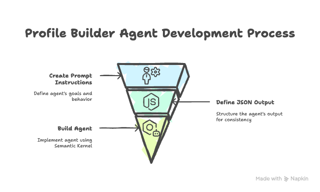
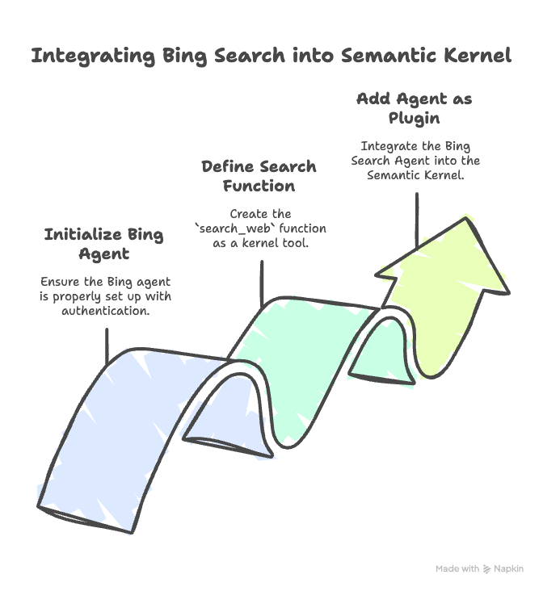
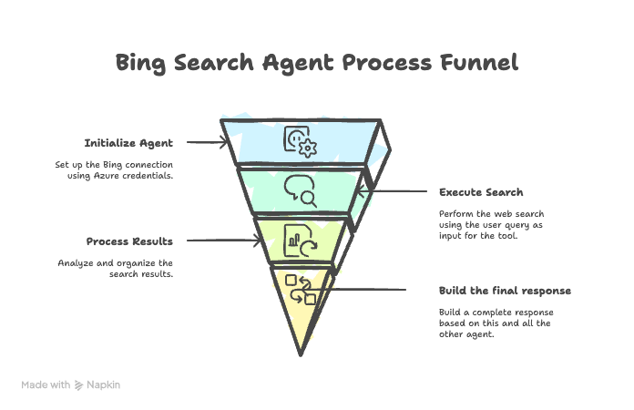
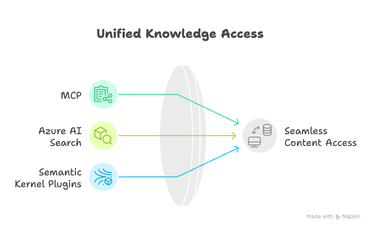
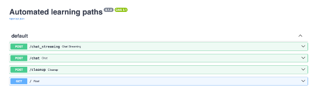
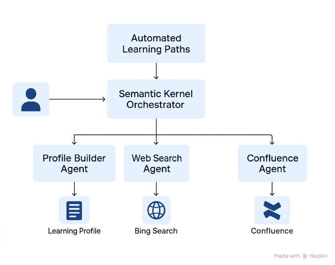

# Hackathon Backend

### Read On Medium 

Read the full series on Medium to learn more about the journey and technical implementation of the Learning Path Assistant:
- [Building a Learning Path Assistant for the Microsoft Hackathon 2025](https://medium.com/gnomondigital/building-a-learning-path-assistant-for-the-microsoft-hackathon-2025-edd7a09bdaaf)
- [Part 1/3: Designing a Multi-Agent System for the Learning Path Assistant](https://medium.com/gnomondigital/part-1-3-designing-a-multi-agent-system-for-the-learning-path-assistant-5328b0b61b6a)
- [Part 2/3: From Architecture to Production with Azure AI Foundry](https://medium.com/gnomondigital/part-2-3-from-architecture-to-production-with-azure-ai-foundry-4d07d726996d)
- [Part 3/3: From Backend Intelligence to Interactive Learning Experience](https://medium.com/gnomondigital/part-3-3-from-backend-intelligence-to-interactive-learning-experience-a353a167a9d8)

## Introduction

This document provides a comprehensive overview of the  architecture for the Learning Path Assistant generator that we created to participate in the Microsoft Hackathon 2025. The backend is designed to handle user interactions, build learning profiles, and retrieve educational resources from both internal resources [the company’s internal data] and external sources [web] to build a customised learning path based on the given profile. 

The orchestration layer leverages multiple plugins, each responsible for specific functionalities, and together creating a coherent flow. ensuring an efficient and personalised user experience.




This diagram provides a high-level overview of how users interact with the backend system:

- **Profile Builder Agent:** Captures user inputs to create a personalized learning profile.
- **Web Search Agent:** Performs Bing searches to retrieve external data and enrich the learning path.
- **Confluence Agent:** Accesses internal resources from Confluence for additional context.

Together, these components are coordinated by the Semantic Kernel Orchestrator to deliver a seamless, customized learning experience.
## Agents and Functionalities

### 1. Profile Builder Agent

The Profile Builder Agent helps users create a personalised learning profile by asking a series of questions about their skills, goals, and preferences. It’s designed to guide users through the process of defining their learning objectives.

**Implementation**
The implementation of this project consists of three steps :

**Step 1: Create Prompt Instructions**

The first step involves creating a prompt that defines the goals of the agent, its behaviour, and the type of information it needs to collect. This prompt serves as the core for the agent's interactions with users. It specifies:
- The purpose of the agent.
- The questions it should ask.
- The behaviour it should exhibit.
- Constraints on what it should or should not do.

**Step 2: Define the JSON Structured Output**

The agent's output is structured using a BaseModel to ensure consistency and clarity. For example:

```python
from pydantic import BaseModel

class Profile(BaseModel):
     current_position: str
     target_role: str
     learning_obstacles: str
     time_limit: str
     preferred_learning_style: list[str]
```

This model defines the structure of the learning profile, which includes fields such as the user's current position, target role, learning obstacles, time constraints, and preferred learning styles.


**Step 3: Build the Agent**

The agent is built using the Semantic Kernel framework. The implementation involves creating kernel functions (tools) and integrating them into the agent. For example:

```python
class MenuPlugin:
    @kernel_function(description="Provides a list of specials from the menu.")
    def get_specials(self) -> Annotated[str, "Returns the specials from the menu."]:
        return """
        Special Soup: Clam Chowder
        Special Salad: Cobb Salad
        Special Drink: Chai Tea
        """

    @kernel_function(description="Provides the price of the requested menu item.")
    def get_item_price(
        self, menu_item: Annotated[str, "The name of the menu item."]
    ) -> Annotated[str, "Returns the price of the menu item."]:
        return "$9.99"
```

For more details, check out the source code: [GitHub - agent_plugin](https://github.com/sphenry/agent_hack/blob/main/02_agent_plugin.py).

For the Profile Builder Agent, the logic is implemented directly from a prompt, which allows for greater flexibility. The agent is initialised with a kernel and configured with the appropriate settings:

```python
class ChatAgentHandler:
...


    async def initialise(self):
        if self.initialised:
            return

        kernel = _create_kernel_with_chat_completion("learning_path_builder")
        settings = OpenAIChatPromptExecutionSettings()
	# the Profile Model is passed in settings as a response format
        settings.response_format = Profile

        profile_builder = ChatCompletionAgent(
            kernel=kernel,
            name="ProfileBuilderAgent",
            instructions=PROFILE_BUILDER_PROMPT,
            arguments=KernelArguments(settings=settings),
        )
....
	kernel.add_plugin(profile_builder, plugin_name="Profile_Builder_Agent")
```
You can check out this  code: [Mixed chat agents](https://github.com/microsoft/semantic-kernel/blob/main/python/samples/concepts/agents/mixed_chat/mixed_chat_agents_plugins.py). 





### 2. Web Search Agent

The Bing Search Agent is designed to perform web searches using Bing as an external tool. It retrieves data sources to create learning paths for users. The agent can search for content, news, or links based on user queries.

**Key Features:**

- **Initialization:** The agent initialises a Bing connection using Azure credentials and creates a thread for processing queries.
- **Search Execution:** The `search_web` is a tool for semantic kernel that performs the search and processes the results.

**Implementation Details:**

The search_web function is defined as a kernel function and performs the following steps:
- The `init_web_agent` method ensures that the Bing agent is properly initialized. It uses DefaultAzureCredential to authenticate and fetches the Bing connection using the connection name defined in the settings.
- The `search_web` function is defined as a kernel function tool. It performs the web search based on the user query and logs the execution process.
- The final step is to add the Bing Search Agent as a plugin to the Semantic Kernel. This allows the kernel to invoke the `search_web` function as part of its operations. 



Here’s the relevant code snippet:
```python
async def init_web_agent(self) -> None:
     logger.info("Initialising web agent.")
     if not self.agent:
          creds = DefaultAzureCredential()
          self.client = AIProjectClient.from_connection_string(
               credential=creds,
               conn_str=Settings.PROJECT_CONNECTION_STRING,
          )
     logger.info("Fetching Bing connection.")
     bing_conn = await self.client.connections.get(
          connection_name=Settings.BING_CONNECTION_NAME
     )
```

Create the searching tool:

```python
@kernel_function(
     name="search_web",
     description="Perform a Bing web search to retrieve data sources for building learning paths. The query can be content, news, or links."
)
async def search_web(self, query: str) -> str:
     logger.info(f"Executing search_web with query: {query}")
```
The final step is is adding our agent the the kernel :

```python
kernel.add_plugin(
     BingSearch(),
     plugin_name="learning_path_building_external_content_web"
)
```
how does calling the agent work : 



### 3. Confluence Agent

The Confluence Agent retrieves internal knowledge from Confluence. It integrates with Confluence using multiple approaches, including MCP (Model Context Protocol), Azure AI Search, and Semantic Kernel Plugins, to provide seamless access to internal content. They all do the same thing but we build it using different methods. 



#### a. MCP (Model Context Protocol)
The Confluence Agent uses the MCPStdioPlugin to interact with Confluence via a Docker-based tool. This plugin connects to Confluence using environment variables for authentication and provides a real-time interface for retrieving data.

```python
self.confluence_plugin = MCPStdioPlugin(
     name="atlassian",
     description="Confluence plugin for Atlassian",
     command="docker",
     args=[
          "run",
          "-i",
          "--rm",
          "-e",
          "CONFLUENCE_URL",
          "-e",
          "CONFLUENCE_USERNAME",
          "-e",
          "CONFLUENCE_API_TOKEN",
          "ghcr.io/sooperset/mcp-atlassian:latest",
     ],
     env={
          "CONFLUENCE_URL": CONFLUENCE_URL,
          "CONFLUENCE_USERNAME": CONFLUENCE_USERNAME,
          "CONFLUENCE_API_TOKEN": CONFLUENCE_API_KEY,
     },
)
await self.confluence_plugin.__aenter__()
kernel.add_plugin(
     self.confluence_plugin,
     plugin_name="learning_path_building_internal_content_mcp"
)
```
[Github example: agents with MCP](https://github.com/microsoft/semantic-kernel/blob/main/python/samples/concepts/mcp/agent_with_mcp_plugin.py)

This approach is ideal for real-time interaction with Confluence APIs and retrieving data directly.

#### b. Azure AI Search Integration

The Confluence Agent uses Azure AI Search to perform advanced search operations on Confluence data. This is achieved by ingesting Confluence content into Azure AI Search and querying it using the Semantic Kernel.

```python
search_client = ConfluenceIngestion().update_content_process()
kernel.add_plugin(
     SearchPlugin(search_client=search_client),
     plugin_name="learning_path_building_internal_content_rag",
)
```
Explanation: 

- `ConfluenceIngestion`: Handles the ingestion of Confluence content into Azure AI Search.

- `SearchPlugin`: Provides the interface for querying the ingested content.

This approach provides scalability and advanced search features, such as natural language querying and ranking.

#### References:

- [Create the azure ai search service.](https://learn.microsoft.com/en-us/azure/ai-services/agents/how-to/tools/azure-ai-search?tabs=azurecli)
- [Ai service and tools](https://learn.microsoft.com/en-us/azure/ai-services/agents/how-to/tools/azure-ai-search?tabs=azurecli&amp%3Bpivots=code-examples)
- [Ai service and semantic kernel](https://github.com/microsoft/ai-agents-for-beginners/blob/main/04-tool-use/code_samples/04-semantic-kernel-python-aiagent-bookinghotel.ipynb)

#### c. Semantic Kernel Plugin Integration

The Confluence Agent is integrated into the Semantic Kernel as a plugin, enabling it to work alongside other agents and tools. This integration allows administrators to manage tools and declare new ones as needed.

```python
kernel.add_plugin(
     AcademyAgent(),
     plugin_name="learning_path_building_internal_content_tools"
)
```
why ? 
- `Tool Management`: Administrators can manage existing tools and declare new ones for specific tasks.
- `Interoperability`: The Confluence Agent can interact with other agents, such as the Web Search Agent and Profile Builder Agent.
### 4. Semantic Kernel Orchestrator

The Semantic Kernel Orchestrator acts as the central hub that integrates and manages multiple agents and plugins. It is responsible for routing user queries to the appropriate agents, combining their outputs, and ensuring a seamless user experience.

The orchestrator processes user queries by invoking the appropriate agents and combining their outputs. It supports both standard and streaming query handling.

## Getting Started


1. Clone the repository:

   ```bash
   git clone https://github.com/your-repo/automated-learning-paths-Hackathon2025.git
   cd automated-learning-paths-Hackathon2025
   ```

2. Configure environment variables:
   - Create a `.env` file in the project's root directory (refer to `example.env`).
   - Define the following variables:
      - `MODEL_DEPLOYMENT_NAME=<Your Azure Model Deployment Name>`
      - `AZURE_AI_INFERENCE_API_KEY=<Your Azure AI Inference API Key>`
      - `AZURE_AI_INFERENCE_ENDPOINT=<Your Azure AI Inference Endpoint>`
      - `CONFLUENCE_URL=<Your Confluence URL>`
      - `CONFLUENCE_USERNAME=<Your Confluence Username>`
      - `CONFLUENCE_API_KEY=<Your Confluence API Key>`

3. Run the backend:

   ```bash
   uv run python -m backend.src.main
   ```

Now the code is ready! You can integrate it into your system and start using the Semantic Kernel Orchestrator along with its agents, such as the Profile Builder Agent, Web Search Agent, Confluence Agent, and others. Ensure that the environment variables are properly configured, and the backend server is running to handle user queries effectively.



## References

- [Semantic Kernel with Python Example](https://www.youtube.com/watch?v=GgEwNwrHA_I)
- [Agent Hack GitHub Repository](https://github.com/sphenry/agent_hack)
- [Microsoft AI Agents for Beginners](https://github.com/microsoft/ai-agents-for-beginners/blob/main/05-agentic-rag/code_samples/05-semantic-kernel-azure-ai-agent.ipynb)

